== Private Automation Hub (synchronize curated Ansible Red Hat Certified and Community content)

=== Task
Synchronize curated Red Hat Automation Hub (Red Hat certified content), and optionally synchronize Ansible content from galaxy.ansible.com (community content).

=== Success Criteria
The content will synchronize successfully and be available in the Private Automation Hub.

==== Synchronize Red Hat Certified Ansible content

. Log in to the Private Automation Hub UI.  Use admin for the username, and the Administrator Password you supplied when you deployed the AAP application.  If you don’t have the URL, please copy it from the Azure AAP application on the *Parameters and OutPuts* page.  Look for *automationHubUrl*.
. Expand the *Collections* menu on the left, and then select *Collections*, adjust the *Filter by repository* to *Red Hat Certified* and notice you have NO content there.
. Select *Repository Management* from the menu on the left, and then select *Remote*.
+
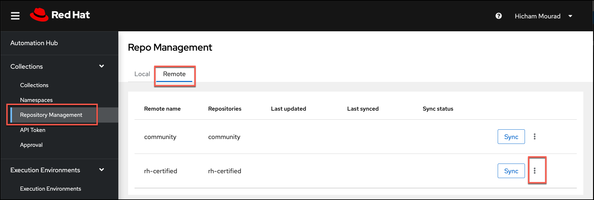
. Select the *3 vertical dots* (vertical ellipsis), and then select *Edit* to synchronize Red Hat certified content from Red Hat Automation Hub on console.redhat.com.
. Here you have *two options*, the first is to use a *Token*, OR the second which is to use your *Red Hat account* on console.redhat.com. 
+
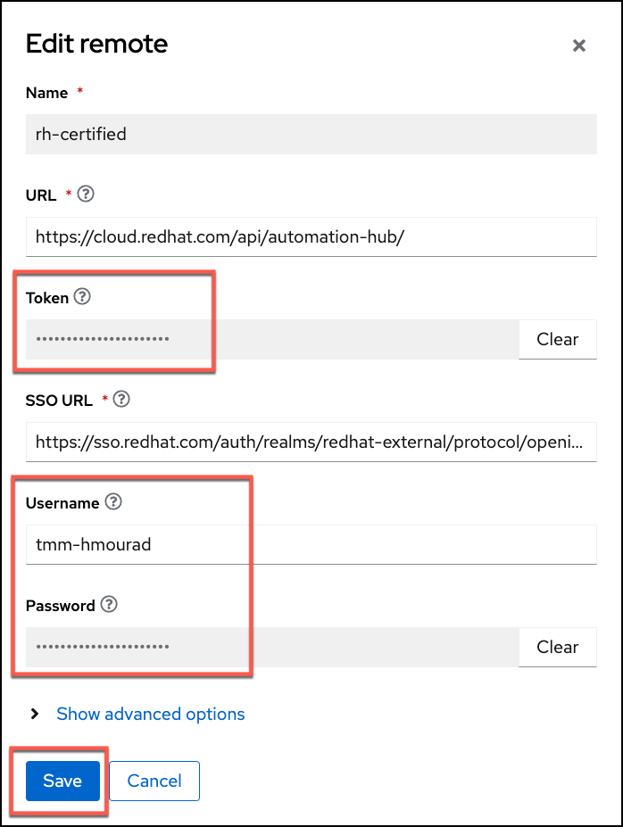
. If you choose to use the *Token* connection method, you will have to login to console.redhat.com and go to the Ansible Automation Hub, and grab the Token.
+
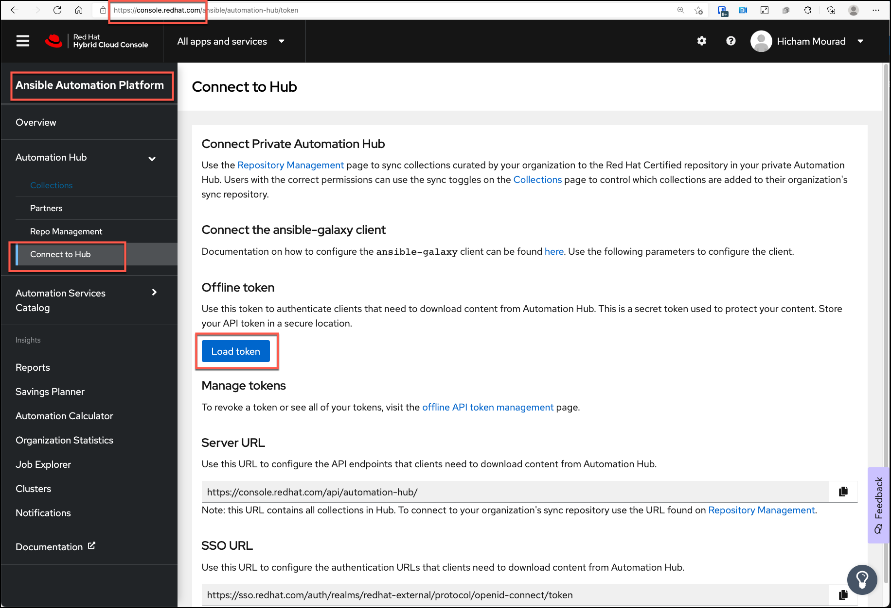
. Insert the Token you just grabbed from console.redhat.com OR your Red Hat username and password in the connection dialog and click *Save*, and then select the *Sync* button.  After a few minutes you should see this has completed successfully.
+
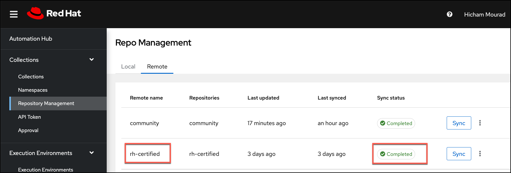
. Go back to the *Collections* menu on the left, and then select *Collections*, adjust the *Filter by repository* to *Red Hat Certified* and notice you now DO have content there.
+
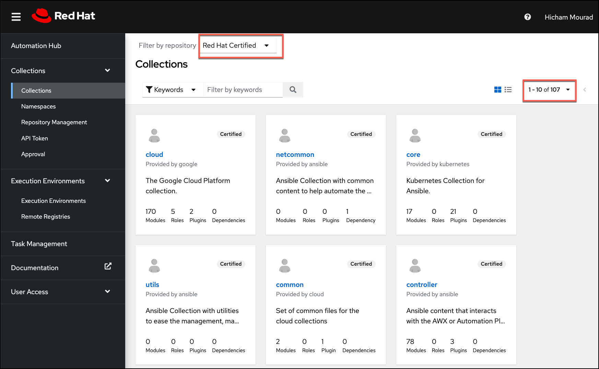
. This Red Hat Certified content can now be consumed by the Ansible Automation Controller.

==== Synchronize Ansible Community content

. Log in to the Private Automation Hub UI.  If you don’t have the URL, please copy it from the Azure AAP application on the *Parameters and OutPuts* page.  Look for *automationHubUrl*.
. Expand the *Collections* menu on the left, and then select *Collections*, adjust the *Filter by repository* to *Community* and notice you have NO content there.
. Select *Repository Management* from the menu on the left, and then select *Remote*.
+
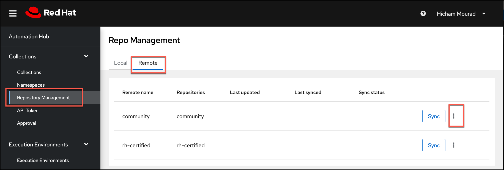
. Select the *3 vertical dots* (vertical ellipsis), and then select *Edit* to configure the community repository (https://galaxy.ansible.com) connection and configuration.
. Create a file on your computer called *requirements.yml* with the following content.
+
[source,sh]
----
---
collections:
 # Install a collection from Ansible Galaxy.
  - name: community.mongodb
   source: https://galaxy.ansible.com
 
 - name: community.general
   source: https://galaxy.ansible.com
----
. Select *Browse* and point to the *requirements.yml* file on your machine.
. Select *Save* and then select the *Sync* button.  After a few minutes you should see this has completed successfully.
+
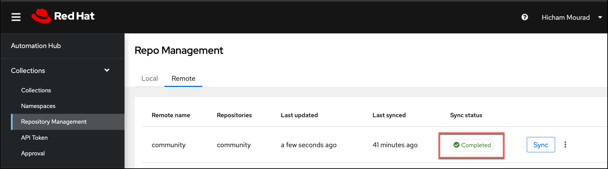
. Go back to the *Collections* menu on the left, and then select *Collections*, adjust the *Filter by repository* to *Community* and notice you now DO have content there.
+
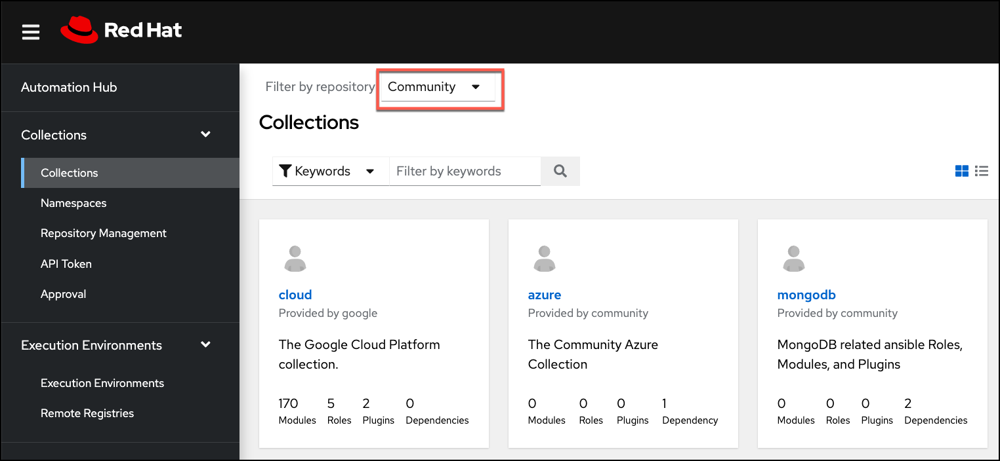
. This Community content can now be consumed by the Ansible Automation Controller.

==== Add Remote Registries in Private Automation Hub

Private Automation Hub can also be the registry for any Execution Environments you may want to use.  This way the Controller won’t have to pull them from the internet, but from Private Automation Hub.  Let’s show how to add a remote registry in Private Automation Hub, and then how to add an Execution Environment.

. Expand *Execution Environments* and select *Remote Registries*
. Select *Add remote registry*, and fill in details similar to the image below with your information. *(URL: https://quay.io)*
. If you have any private Repos there with custom Execution Environments, you can synchronize them now.
+
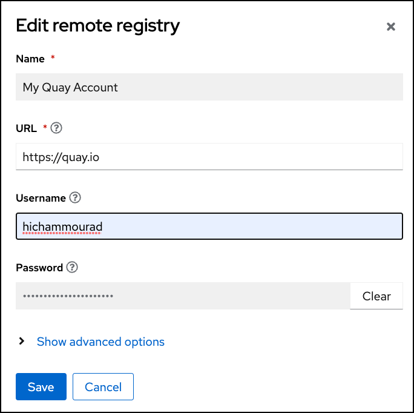
+
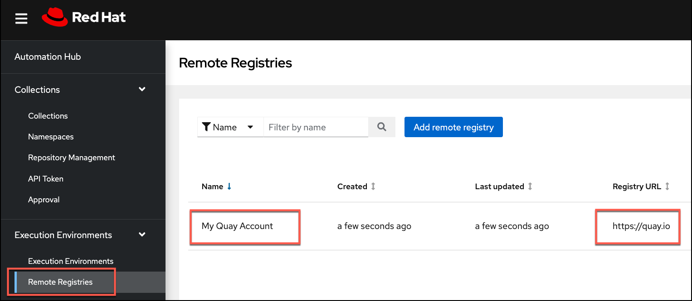
. For public Repos you don’t need the registry credentials, they can be left blank. *Add another registry for public images from quay.io (URL: https://quay.io)*
+
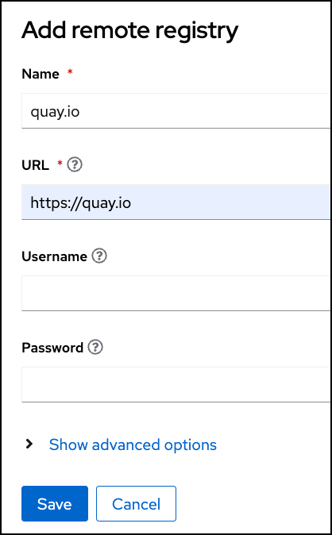
+
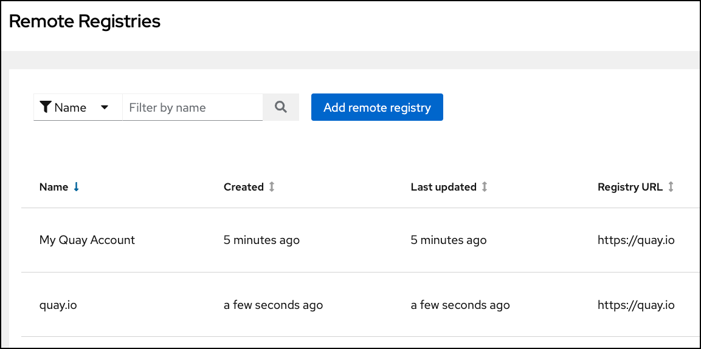
. Now let’s pull in an Execution Environment image, into Private Automation Hub.
. Expand *Execution Environments* and select *Execution Environments*
. Select *Add execution environment*, and fill in details similar to the image below.
. *Name*:  another-azure-ee
. *Upstream name*:  scottharwell/azure-execution-env
. *Registry*: From the drop down select  quay.io
. *Add tag*:  latest
. *Save*.
+
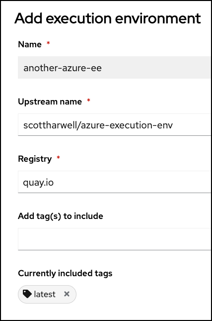
. Once it’s added, you still need to synchronize the Execution Environment from the registry. Select the *3 vertical dots* (vertical ellipsis), and select *Sync from registry*
+
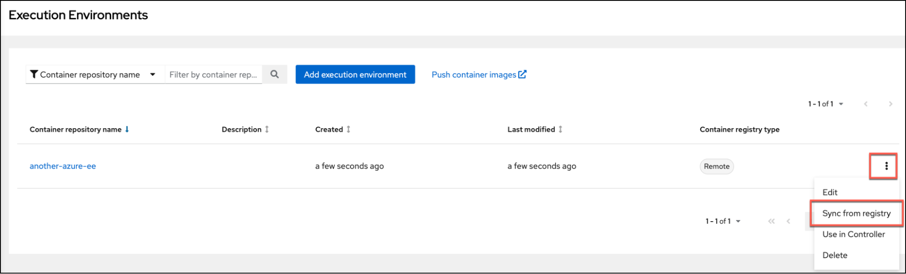
. You can monitor the status of the synchronization from the *Task Management* menu on the left
. Select the newly added Execution Environment and check it’s detail
+
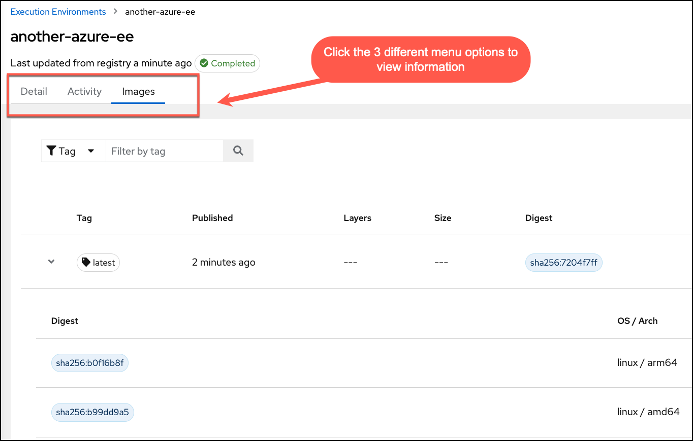
. Now, Let’s have the Automation Controller use this Execution Environment.  Select the *3 vertical dots* (vertical ellipsis), and select *Use in Controller*
+

. You’ll be presented with a dialog.  You should see your controller name.  
+
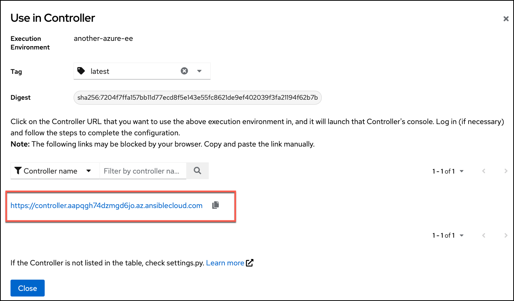
. Click on the controller name.  This will launch you to the *Automation Controller’s* Execution Environments UI
. Add the *Name*.  Make it the same: *another-azure-ee*
. *Pull Policy*:  Select “Only pull the image if not present before running”
. *Registry Credentials*:  Select “My Private Automation Hub” from the dropdown list
+
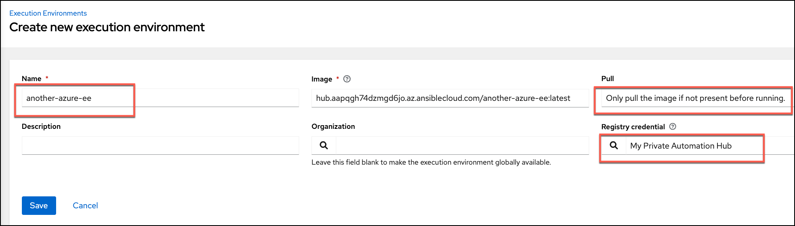
. With this Execution Environment added to Automation Controller, you can if you wish adjust Projects or Job Templates to use this EE.  It will get pulled from the Private Automation Hub
