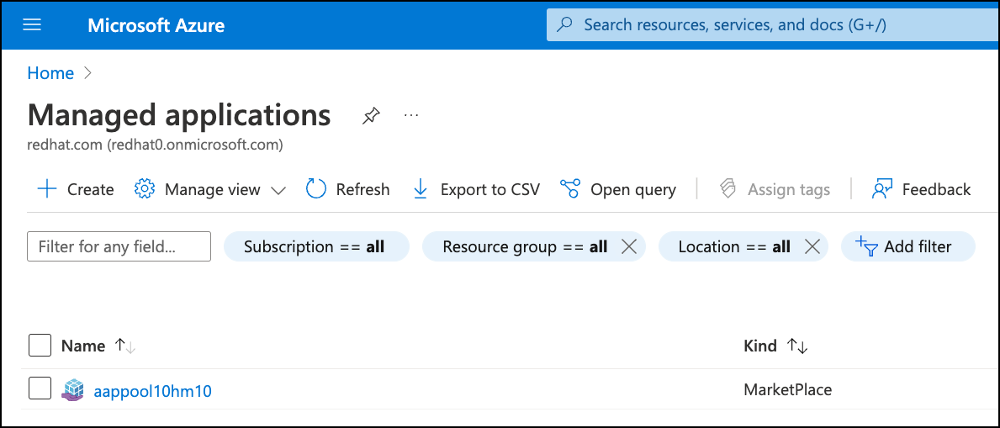
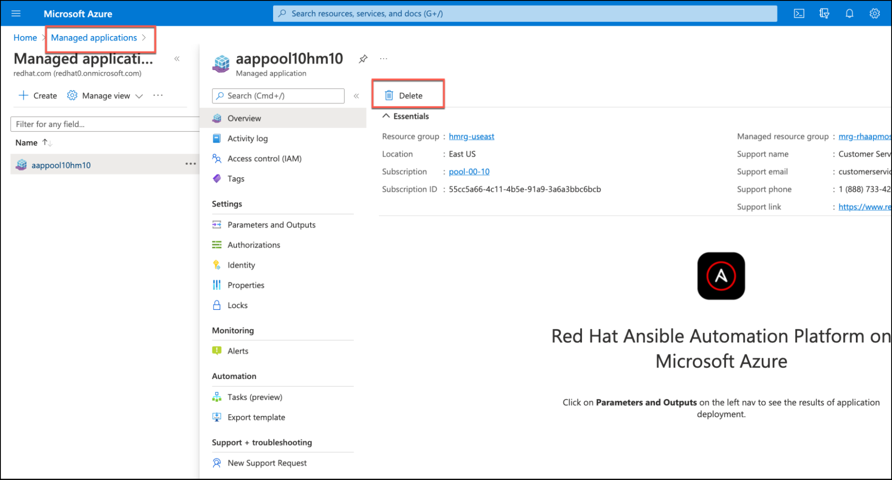
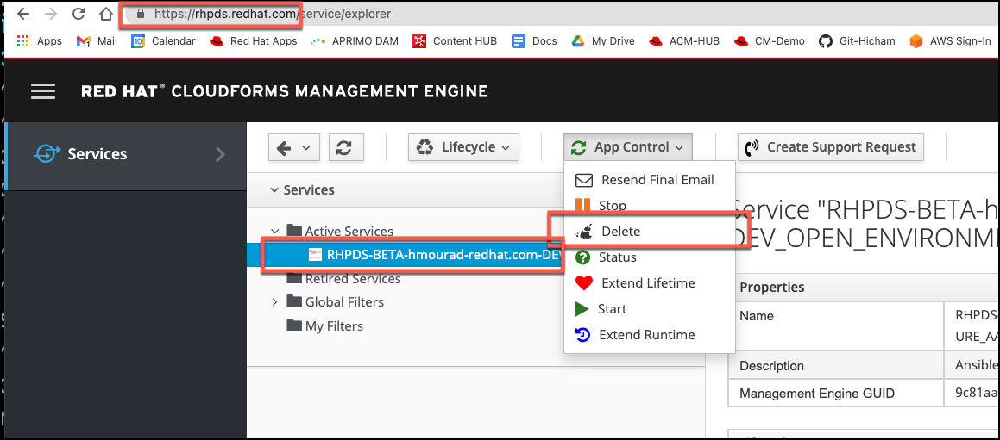

== Module Topics
:linkattrs:

* Instructions
* Final Step - Deprovision the RHPDS Environment

== Instructions

* Ensure that you have deleted or removed any Azure resources that you provisioned with Ansible Automation Platform before deleting Red Hat Ansible Automation Platform on Microsoft Azure managed application
* From the Azure Console, navigate to “Managed Applications”
* Select your instance of Red Hat Ansible Automation Platform on Microsoft Azure you intend to deprovision

* Select the “Overview” tab from the left menu if not already selected
* Click the “Delete” button
* Step through the pop ups asking you to confirm deletion of the application “Yes”

* This will take some time to complete.

== Final Step - Deprovision the RHPDS Environment

* Login to the RHPDS environment.
* Hover over "Services", then go to "My Services"
* Select the "App Control" drop down, and click on "Delete"

* Thank you for using this Lab / Demo environment of Red Hat Ansible Automation Platform on Microsoft Azure!

